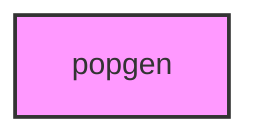

# POPGEN

## Overview
Functionality for popgen.

## 📦 Contents
- `[__init__.py](__init__.py)`
- `[test_analysis.py](test_analysis.py)`
- `[test_import_contract.py](test_import_contract.py)`

## 📊 Structure



## Usage
Import module:
```python
from metainformant.popgen import ...
```
