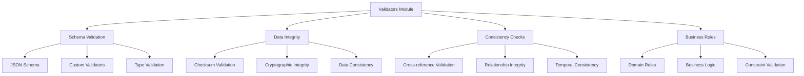
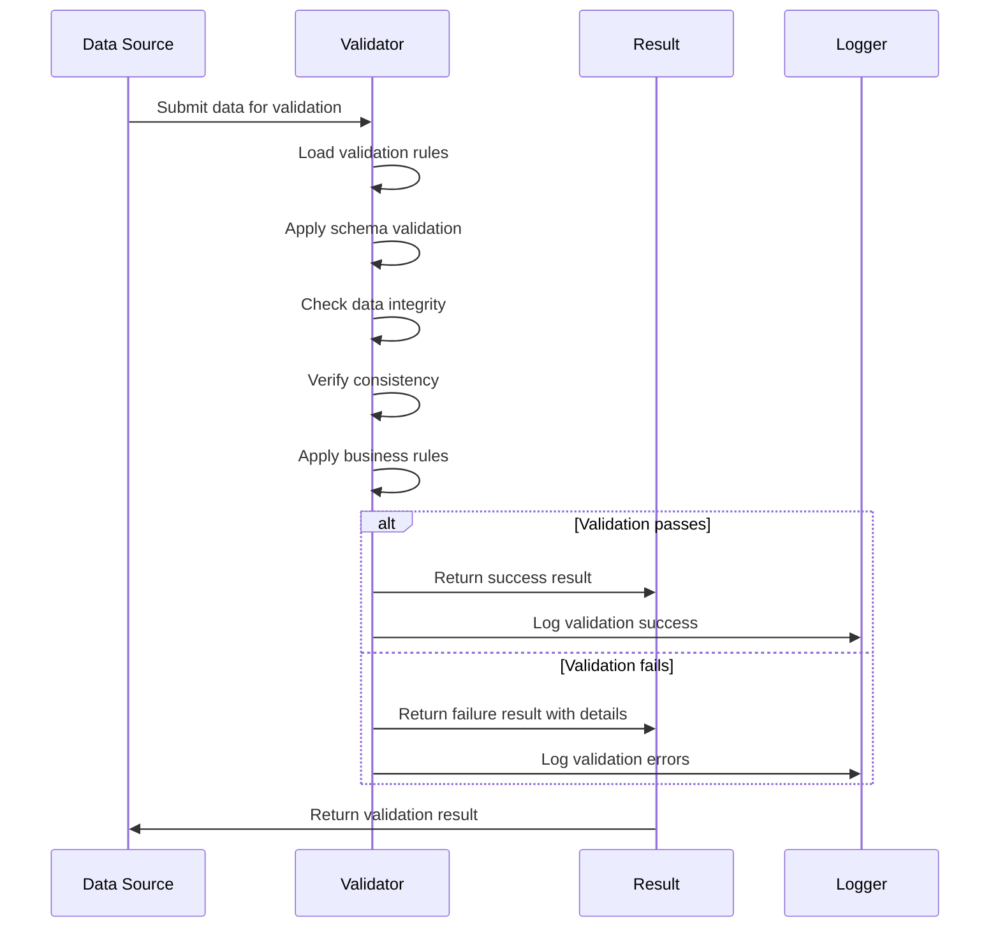

# MetaInformAnt Validators Module

The validators module provides comprehensive data validation and integrity checking capabilities for the MetaInformAnt system.

## Overview



## Module Purpose

The validators module is designed to ensure data quality, integrity, and compliance across the MetaInformAnt system. It provides:

- **Schema Validation**: Validate data against predefined schemas
- **Integrity Checks**: Ensure data integrity through checksums and cryptographic methods
- **Consistency Verification**: Check data consistency across multiple sources
- **Business Rule Enforcement**: Apply domain-specific validation rules

## Architecture

### Validation Pipeline



## Planned Components

### SchemaValidator Class

```python
class SchemaValidator:
    """Validates data against JSON schemas and custom validation rules."""

    def __init__(self, schema_registry: Dict[str, Dict]) -> None:
        """Initialize with schema registry."""

    def validate(self, data: Any, schema_name: str) -> ValidationResult:
        """Validate data against named schema."""

    def add_schema(self, name: str, schema: Dict) -> None:
        """Add schema to registry."""
```

### IntegrityValidator Class

```python
class IntegrityValidator:
    """Validates data integrity using checksums and cryptographic methods."""

    def validate_checksum(self, data: Any, expected_hash: str, algorithm: str = 'sha256') -> bool:
        """Validate data against expected checksum."""

    def generate_integrity_hash(self, data: Any, algorithm: str = 'sha256') -> str:
        """Generate integrity hash for data."""
```

### ConsistencyValidator Class

```python
class ConsistencyValidator:
    """Validates data consistency across multiple datasets."""

    def validate_relationships(self, datasets: List[Dict], relationships: List[Dict]) -> ConsistencyResult:
        """Validate relationships between datasets."""

    def check_referential_integrity(self, primary_data: Dict, foreign_data: Dict, key_mapping: Dict) -> bool:
        """Check referential integrity constraints."""
```

## Usage Examples

### Basic Schema Validation

```python
from metainformant.validators import SchemaValidator

# Initialize validator
validator = SchemaValidator({
    'user_schema': {
        'type': 'object',
        'properties': {
            'name': {'type': 'string'},
            'age': {'type': 'integer', 'minimum': 0}
        },
        'required': ['name']
    }
})

# Validate data
user_data = {'name': 'John', 'age': 30}
result = validator.validate(user_data, 'user_schema')

if result.valid:
    print("Data is valid")
else:
    print(f"Validation errors: {result.errors}")
```

### Integrity Checking

```python
from metainformant.validators import IntegrityValidator

validator = IntegrityValidator()

# Generate hash for data
data = {'sensitive': 'information'}
data_hash = validator.generate_integrity_hash(data)

# Later, validate integrity
is_valid = validator.validate_checksum(data, data_hash)
assert is_valid == True
```

## Configuration

### Validator Configuration

```python
validator_config = {
    'strict_mode': True,              # Enable strict validation
    'fail_fast': False,               # Continue validation after first error
    'cache_schemas': True,            # Cache loaded schemas
    'custom_validators': {            # Custom validation functions
        'email': validate_email_format,
        'phone': validate_phone_format
    },
    'integrity_algorithms': ['sha256', 'md5'],  # Supported hash algorithms
    'logging_level': 'INFO'           # Validation logging level
}
```

## Integration Points

### Orchestrator Integration

```python
# Validators integrate with orchestrator for automatic validation
orchestrator.register_validator(schema_validator, ['validate_schema'])
orchestrator.register_validator(integrity_validator, ['check_integrity'])

# Automatic validation during task execution
task = Task(operation='process_data', parameters={'validate_schema': True})
result = orchestrator.coordinate_task(task)
```

### Processor Integration

```python
# Validators enhance processor data handling
processor = DataProcessor({
    'enable_validation': True,
    'validator_config': validator_config
})

# Validation occurs during data ingestion and transformation
processed_data = processor.ingest_data(data_source)
```

## Error Handling

### Validation Errors

```python
try:
    result = validator.validate(data, schema_name)
    if not result.valid:
        for error in result.errors:
            logger.error(f"Validation error: {error}")
        raise ValidationError(f"Schema validation failed: {result.errors}")
except ValidationError as e:
    # Handle validation failure
    handle_validation_failure(e)
```

## Best Practices

### Schema Design

1. **Clear Structure**: Define clear, unambiguous schemas
2. **Versioning**: Include version information in schemas
3. **Documentation**: Document all schema fields and constraints
4. **Validation Rules**: Use appropriate validation rules for data types

### Performance Considerations

1. **Caching**: Cache frequently used schemas and validators
2. **Batch Validation**: Validate multiple items together when possible
3. **Lazy Loading**: Load validation rules on demand
4. **Resource Limits**: Set appropriate timeouts and resource limits

### Error Reporting

1. **Detailed Messages**: Provide clear, actionable error messages
2. **Error Context**: Include context information for debugging
3. **Severity Levels**: Categorize errors by severity
4. **Logging**: Comprehensive logging of validation activities

## Future Extensions

### Planned Features

- **Advanced Schema Languages**: Support for XML Schema, Avro, Protocol Buffers
- **Machine Learning Validation**: ML-based anomaly detection
- **Real-time Validation**: Streaming data validation
- **Distributed Validation**: Validation across distributed systems
- **Custom Rule Engines**: Pluggable validation rule engines

This module will be populated with concrete implementations following the established MetaInformAnt architecture patterns.

